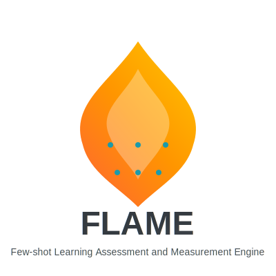
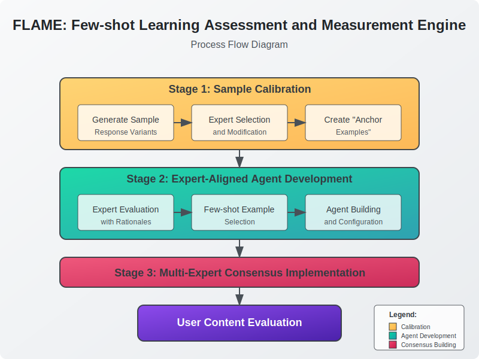

# FLAME: Few-shot Learning Assessment and Measurement Engine

A psychometrics-inspired framework for creating, training, and deploying AI-based evaluation systems using few-shot learning principles.

<p align="center">
  
</p>

## Overview

FLAME transforms subjective AI evaluation into a systematic, scalable measurement process while preserving human expertise. By combining principles from psychometric testing with few-shot learning techniques, FLAME enables consistent, reliable assessments of AI-generated content across multiple quality dimensions.

### Key Features

- **Calibrated Sample Library**: Hierarchical organization of examples representing different quality levels
- **Expert Judgment Capture**: Systematic collection of expert evaluations with detailed rationales
- **Few-shot Agent Construction**: Automatic creation of evaluation agents trained on expert examples
- **Multi-dimensional Assessment**: Support for diverse evaluation criteria (accuracy, coherence, helpfulness, etc.)
- **Lightweight Implementation**: Built with Flask and SQLite for easy deployment and customization

## System Workflow

The following diagram illustrates FLAME's end-to-end process flow:



## How FLAME Works

FLAME operates through a three-stage process:

### Stage 1: Sample Calibration

Drawing from psychometric test development methods, FLAME establishes a hierarchical sample library for each evaluation dimension...

### Prerequisites

- Python 3.8+
- pip
- SQLite

### Setup

1. Clone the repository:
```
git clone https://github.com/your-username/flame.git
cd flame
```

2. Create a virtual environment:
```
python -m venv venv
source venv/bin/activate  # On Windows: venv\Scripts\activate
```

3. Install dependencies:
```
pip install -r requirements.txt
```

4. Create a `.env` file with your configuration:
```
OPENAI_API_KEY=your_api_key_here
DEFAULT_MODEL=gpt-4
SECRET_KEY=your_secret_key_for_flask
```

5. Initialize the database:
```
flask --app app.py init-db
```

6. Run the application:
```
flask --app app.py run
```

## How FLAME Works

FLAME operates through a three-stage process:

### Stage 1: Sample Calibration

Drawing from psychometric test development methods, FLAME establishes a hierarchical sample library for each evaluation dimension. The system uses advanced reasoning models to generate response variants of different difficulty, style, and quality. Experts select or modify these responses to create "anchor examples" representing different performance levels.

### Stage 2: Expert-Aligned Agent Development

Rather than simple fine-tuning, FLAME incorporates parameter estimation methods from Item Response Theory. Each evaluation dimension is treated as a latent trait with specific discrimination and difficulty parameters. The trained agents not only score content but also quantify evaluation uncertainty. Through test-retest reliability and inter-rater consistency checks, the system ensures agents truly capture expert judgment criteria.

### Stage 3: Multi-Expert Consensus Implementation

The final stage employs a simplified Bayesian model averaging approach, considering each expert agent's domain reliability. The system flags cases with significant expert disagreement for manual review. As usage grows, FLAME gradually builds a multi-dimensional evaluation space, revealing the underlying structure of "quality" across different expert perspectives.

## Usage Guide

### 1. Define Evaluation Dimensions

```
POST /api/dimensions
{
  "name": "Factual Accuracy",
  "description": "The degree to which the response contains correct factual information",
  "scoring_guide": "10: Perfect accuracy with comprehensive coverage...\n1: Serious factual errors throughout..."
}
```

### 2. Add Calibration Samples

```
POST /api/samples
{
  "content": "The sample content to evaluate...",
  "dimension_id": 1
}
```

### 3. Collect Expert Evaluations

```
POST /api/experts/evaluate
{
  "sample_id": 1,
  "dimension_id": 1,
  "score": 8,
  "rationale": "This response is generally accurate but contains one minor error...",
  "expert_name": "Dr. Smith"
}
```

### 4. Create Evaluation Agent

```
POST /api/evaluation/agent
{
  "name": "Accuracy Evaluator v1",
  "dimension_id": 1,
  "model_name": "gpt-4",
  "fewshot_example_ids": [1, 3, 5, 7, 9]
}
```

### 5. Evaluate New Content

```
POST /api/evaluation/evaluate
{
  "content": "The content to evaluate...",
  "dimension_id": 1
}
```

Response:
```
{
  "score": 7,
  "rationale": "The response is generally accurate but contains two minor factual errors..."
}
```

## Architecture

FLAME follows a clean layered architecture:

- **Models**: Database schema definitions (SQLAlchemy)
- **Services**: Core business logic implementation
- **Controllers**: RESTful API endpoints (Flask)
- **Utils**: Helper functions and external API integrations

## Theoretical Foundation

FLAME represents a novel synthesis of:

- **Psychometric Testing**: Borrowing concepts like calibrated items, test construction, and Item Response Theory
- **AI Few-shot Learning**: Leveraging contextual examples to guide model judgment
- **Human-AI Alignment**: Ensuring AI evaluations match expert human judgment

## Applications

- **AI Product Development**: Standardize quality evaluation across development stages
- **Research**: Study alignment between human and AI judgment criteria
- **Education**: Assess AI-generated educational content
- **Content Moderation**: Create consistent evaluation standardss

## License

This project is licensed under the MIT License - see the [LICENSE](LICENSE) file for details.